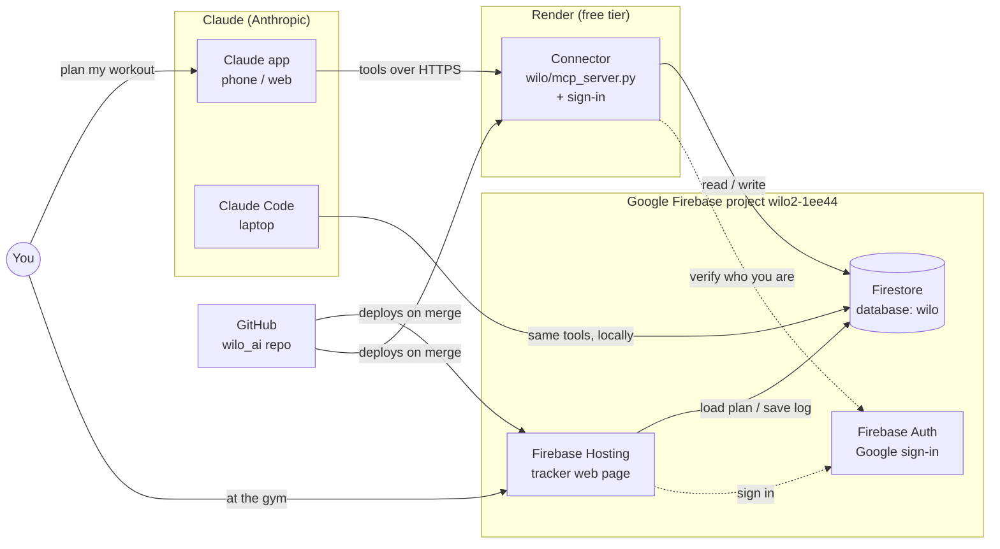
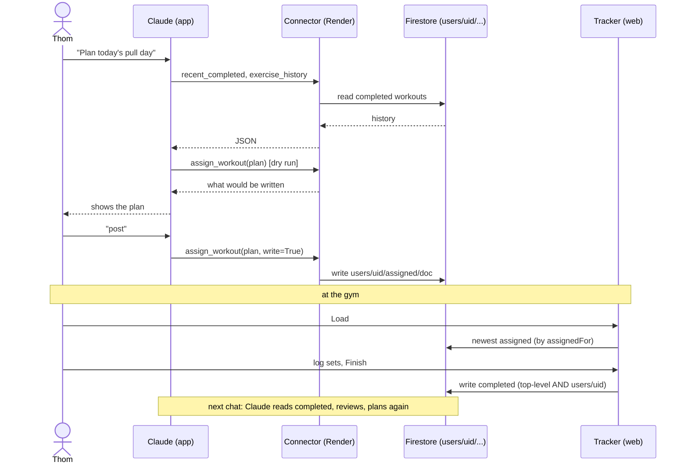
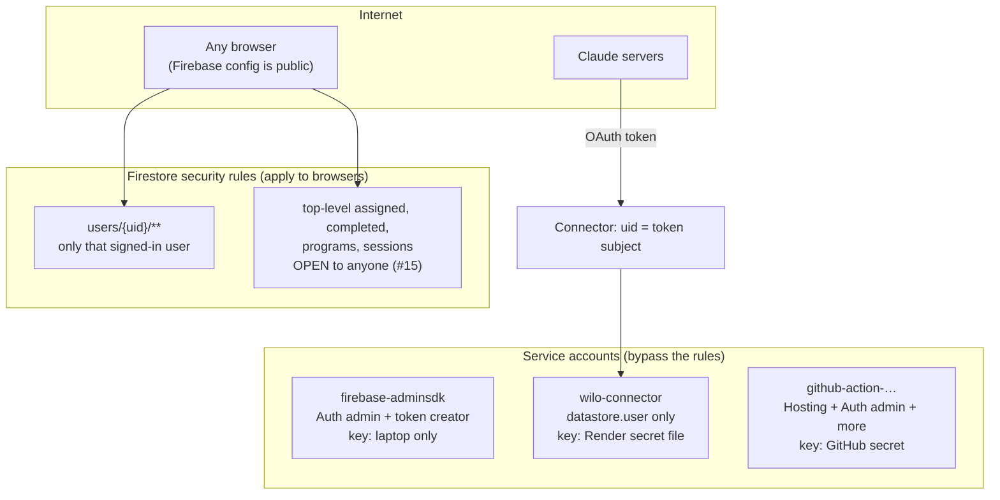

# WILO infrastructure: how it works and how to rebuild it

**For:** Thom, the team, and future Claude sessions. It also serves as the outline for a talk.
**State as of:** 2026-10-09, checked against the live systems (GitHub, Firebase, GCP, Render, claude.ai, the laptop), not written from memory.
**Keep it current:** when a piece moves, update this file in the same PR.

Contents: [1. One minute](#1-the-one-minute-version) · [2. The pieces](#2-the-pieces) · [3. A workout's journey](#3-a-workouts-journey) · [4. Security](#4-security-model) · [5. Deep dive](#5-deep-dive-per-component) · [6. Rebuild](#6-rebuild-from-scratch-checklist) · [7. Gaps](#7-gaps-what-we-cant-recover-today) · [8. If we did it again](#8-if-we-built-it-again)

---

## 1. The one-minute version

WILO is a workout coach in three parts:
1. **You talk to Claude** (phone app, web, or Claude Code on the laptop). Claude plans your next workout.
2. **Claude saves the plan through a small server we wrote** (the *connector*) into a **Firestore database**.
3. **At the gym, the tracker web page** loads the plan, you log sets, and Finish saves what you actually did. Next time you talk to Claude, it reads that and adjusts.

Everything is tied to your **Google sign-in**, so each person only sees their own workouts.



**Talk version (5 lines):** chat → plan → database → tracker → log → chat. The AI never touches the database directly: it calls 8 small tools, and our code decides whose data they touch. Writes are dry runs until you say yes. It costs $0/month today. All code is in one GitHub repo, and merging to `main` deploys it.

---

## 2. The pieces

| Piece | What it is | Where it lives | Config is in | Deploys how | Cost |
|---|---|---|---|---|---|
| **Repo** `CoachThomLamb/wilo_ai` | All code, docs, rules | GitHub (**public**) | `main` | — | $0 |
| **Tracker** `fe/index.html` (+ `builder.html`, `auth.js`) | Plain HTML page: Load, log sets, Finish | Firebase Hosting `https://wilo2-1ee44.web.app` | `firebase.json` | GitHub Action on merge to `main`; preview per PR | $0 (Spark) |
| **Firestore** database `wilo` | All workout data + sign-in tokens | GCP `northamerica-northeast2` (Toronto) | `firestore.rules`, `config/wilo.json` | Rules: **manually** with `firebase deploy --only firestore:rules` | $0 (free quota) |
| **Firebase Auth** | Google sign-in, one uid per person | Firebase project `wilo2-1ee44` | Console only (provider: Google; authorized domains) | Console | $0 |
| **Data engine** `wilo/data.py` | All Firestore logic + CLI | Repo (runs wherever it's imported) | `config/wilo.json`, `schema/workout.schema.json` | With the connector | — |
| **Connector** `wilo/mcp_server.py` + `wilo/auth.py` + `wilo/login.html` | MCP server: 8 tools + OAuth sign-in | Render web service `wilo-connector` → `https://wilo-connector.onrender.com/mcp` | `Dockerfile`; env + secret file **in the Render dashboard** | Render auto-deploys every commit to `main` | $0 (sleeps after 15 min) |
| **Local MCP server** | Same tools over stdio, for Claude Code | Laptop: `.venv`, editable install | `~/.claude.json` (`claude mcp add wilo …`) | Runs the checked-out branch | $0 |
| **claude.ai connector** | "wilo" custom connector (DCR + sign-in) | Thom's claude.ai account | claude.ai → Settings → Connectors | Manual, once per user | Claude plan |
| **Coach skill** `wilo-workout-coach` | Coaching instructions for Claude | **claude.ai only (not in the repo), and stale** — see [gaps](#7-gaps-what-we-cant-recover-today) | claude.ai → Skills | Manual upload | — |
| **Service accounts** (GCP) | Machine identities with keys | GCP IAM | See [§4](#4-security-model) | `gcloud` / console | $0 |
| **Laptop** | Keys, venv, local backups | `~/wilo`, `~/wilo-claude/`, `~/wilo/data/` | — | — | — |

**Accounts that own things:** GitHub `CoachThomLamb`; Google `thomlamb74@gmail.com` (the only **owner** of the GCP/Firebase project); Render (signed in with GitHub); claude.ai. **Billing:** none. The project has no active billing account (Spark plan), so Cloud Run, scheduled backups and anything else that needs Blaze are unavailable.

---

## 3. A workout's journey



**Data layout (Firestore database `wilo`):**

| Path | What | Written by |
|---|---|---|
| `users/{uid}/assigned/{docId}` | Planned workouts (`assignedFor` = the day) | Connector / CLI |
| `users/{uid}/completed/{docId}` | Finished workouts (`finishedAt`) | Tracker Finish |
| `oauth_clients`, `oauth_pending`, `oauth_codes`, `oauth_access`, `oauth_refresh` | Connector sign-in state, sha256-hashed | Connector |
| `assigned`, `completed`, `programs`, `sessions` (top level) | **Legacy**, world-readable and writable (#15). The tracker still writes `completed` here and reads `assigned` from here | Tracker, old coach skill |

Doc counts on 2026-10-09: `users/{Thom}`: 12 assigned, 8 completed. Top level: 8 assigned, 7 completed, 11 programs, 6 sessions. oauth: 1 client, 1 access, 1 refresh.

---

## 4. Security model

**Who can touch what:**



- **Browsers** go through the Firestore rules. `users/{uid}/**` is locked to that user. **The four legacy top-level collections are open to the world** (`if true`). That's #15, and it must be fixed before anyone else uses the tracker.
- **The connector** decides whose data a call touches from the OAuth token (`current_uid()`). The uid is never a tool argument. It refuses to listen publicly without sign-in (`--public-url` requires `--auth` and https).
- **Service accounts bypass the rules**, so their keys are the crown jewels:

| Service account | Roles | Key lives | Used by |
|---|---|---|---|
| `firebase-adminsdk-fbsvc@…` | `firebaseauth.admin`, `iam.serviceAccountTokenCreator`, `firebase.sdkAdminServiceAgent` | `~/wilo-claude/service-account.json` (**plus an unused copy** at `~/.config/wilo/service-account.json`) | Local CLI + local MCP server |
| `wilo-connector@…` (2026-10-09) | `datastore.user` only | Render secret file `wilo-connector-key.json`; local copy `~/wilo-claude/wilo-connector-key.json` | The hosted connector |
| `github-action-1362674060@…` | `firebasehosting.admin`, `firebaseauth.admin`, `cloudfunctions.developer`, `run.viewer`, `serviceusage.*` | GitHub secret `FIREBASE_SERVICE_ACCOUNT_WILO2_1EE44` | Hosting deploys (created by `firebase init hosting:github`) |

- **Not secrets (public by design):** the Firebase web config (`apiKey` etc. in `fe/index.html`, `fe/builder.html`, `wilo/login.html`), Thom's uid in `config/wilo.json`. They identify the project but don't grant access. The rules and the server do that.
- **Firebase Auth authorized domains:** `localhost`, `wilo2-1ee44.firebaseapp.com`, `wilo2-1ee44.web.app`, `wilo-connector.onrender.com`, plus one `wilo2-1ee44--prNN-….web.app` per PR preview (added automatically, low risk, clutter).

---

## 5. Deep dive per component

The code-level guide for the connector is [`mcp-server-and-connector-guide.md`](mcp-server-and-connector-guide.md) (rules, OAuth flow, tests, gotchas). The sign-in design is [`connector-sign-in.md`](connector-sign-in.md), the layering is [`principles.md`](principles.md). This section covers what those don't: the infrastructure around the code.

### 5.1 GitHub
- Repo `CoachThomLamb/wilo_ai`, **public**, default branch `main`. Work happens on branches with PRs, and merging to `main` deploys (Hosting via Actions, connector via Render).
- **Actions:** `firebase-hosting-pull-request.yml` (preview channel per PR, expires after 7 days), `firebase-hosting-merge.yml` (live deploy on push to `main`). **No tests run in CI** (#46).
- **Secret:** `FIREBASE_SERVICE_ACCOUNT_WILO2_1EE44` (the github-action key, created 2026-09-25).
- Gitignored on purpose: `data/` (local Firestore dumps), `.claude/skills/`, `.agents/`, `.env`.

### 5.2 Firebase project `wilo2-1ee44`
- Project number `103580826325`. One web app "Wilo" (`1:103580826325:web:0e5cc800c5cbb29691c05c`). Plan: **Spark** (no billing).
- **Hosting:** site `wilo2-1ee44` serves `fe/`. `firebase.json` sets `Cache-Control: no-cache` on HTML/JS so phones get new versions.
- **Firestore:** named database **`wilo`** (not `(default)`, so every client must name it), Native mode, `northamerica-northeast2`. **Point-in-time recovery: off. Delete protection: off. Backup schedules: none.**
- **Rules:** `firestore.rules`, deployed **by hand** (last release 2026-10-02). Checked 2026-10-09: the deployed rules match the repo apart from comments.
- **Auth:** Google provider only.
- Thom's Google account also has ~26 other Firebase projects (e.g. an older `wiloworkout-85481`). Only `wilo2-1ee44` is live.

### 5.3 Connector on Render
- Service `wilo-connector`: repo `wilo_ai`, branch `main`, Docker (`Dockerfile` at the root), Free instance, region Virginia, auto-deploy on every commit to `main`.
- Env: `PUBLIC_URL=https://wilo-connector.onrender.com`, `GOOGLE_APPLICATION_CREDENTIALS=/etc/secrets/wilo-connector-key.json`. Render sets `$PORT`.
- Secret file: `wilo-connector-key.json` (the `wilo-connector` key).
- **All of this lives only in the Render dashboard.** There's no `render.yaml`.
- Sleeps after 15 min idle. The first request takes ~1 min.
- Why Render: Google billing rejected the prepaid card, so Cloud Run wasn't possible. Details and the Cloud Run alternative are in the connector guide.

### 5.4 Python package `wilo/`
- `pyproject.toml`: Python ≥ 3.12; dependencies `firebase-admin`, `jsonschema`, `mcp` are **unpinned**. **The code needs MCP SDK v2** (`MCPServer`). Working versions on 2026-10-09: Python 3.14.7, `mcp` 2.3.0, `firebase-admin` 7.7.0, `google-cloud-firestore` 2.31.0, `jsonschema` 4.26.0, `starlette` 1.7.0, `uvicorn` 0.54.0, `pydantic` 2.13.5.
- Docker base image `python:3.14-slim` (a tag, not a digest).
- 70 tests, all with fakes, no Firestore needed: `.venv/bin/python -m unittest discover tests`.

### 5.5 Claude side
- **claude.ai:** custom connector "wilo" → `https://wilo-connector.onrender.com/mcp`, Sign in now + Register automatically (DCR). Read tools always allowed; `assign_workout` / `update_workout` need approval. Works on web and phone.
- **Claude Code (laptop):** `claude mcp add wilo -s local -- /home/thom/wilo/.venv/bin/python -m wilo.mcp_server` (stdio, admin key, Thom's uid from `config/wilo.json`).
- **Instructions Claude reads:** the server's `INSTRUCTIONS` string and the tool docstrings in `wilo/mcp_server.py` (#40 moves them to one file); `CLAUDE.md`, `.claude/instructions.md`, `.claude/memory.md` for coding sessions.
- **Coach skill `wilo-workout-coach`:** lives on claude.ai and syncs to `~/.claude/skills/synced/…/wilo-workout-coach/SKILL.md`. **Stale:** it describes the old `sessions`/`programs` collections, an old document shape, and `scripts/wilo_fs.py`, which no longer exists. Today the coaching actually comes from the connector's instructions + the conversation.

### 5.6 The laptop
- `~/wilo` (repo + `.venv`), `~/wilo-claude/service-account.json` (admin key), `~/wilo-claude/wilo-connector-key.json` (connector key), `~/.config/wilo/service-account.json` (unused duplicate admin key).
- **The only Firestore backups:** `~/wilo/data/backup-2026-10-05/` and `backup-2026-10-07/` (one JSON file per collection, made by hand).
- Tools: `gh`, `docker`, `firebase` (15.29.0), `gcloud` (585, `google-cloud-cli-lite` from the AUR; on PATH in new login shells, else `/opt/google-cloud-cli/bin/gcloud`).

---

## 6. Rebuild from scratch (checklist)

Ordered so that each step only depends on earlier ones. Secrets are **generated**, never copied from this doc. Not yet tested end to end; that's a separate task.

**0. Accounts and tools**
- [ ] Accounts: GitHub (`CoachThomLamb`), Google (owner of the Firebase project), Render (sign in with GitHub), claude.ai.
- [ ] Tools: `git`, Python ≥ 3.12, `docker`, `gh`, Firebase CLI (`npm i -g firebase-tools`), `gcloud` (Omarchy: `omarchy pkg aur add google-cloud-cli`).

**1. Code**
- [ ] `git clone https://github.com/CoachThomLamb/wilo_ai.git ~/wilo && cd ~/wilo`
- [ ] `python -m venv .venv && .venv/bin/pip install -e .`. If `mcp` resolves to anything but 2.x, pin `mcp>=2,<3` (see §5.4).
- [ ] `.venv/bin/python -m unittest discover tests` → 70 OK.

**2. Firebase project** (skip if `wilo2-1ee44` still exists)
- [ ] Create the project. Add a **web app** and copy its config into the `initializeApp({...})` blocks in `fe/index.html`, `fe/builder.html` and `wilo/login.html`.
- [ ] Firestore: create the **named database `wilo`** in `northamerica-northeast2`, Native mode. Turn on **delete protection**.
- [ ] Auth: enable the **Google** provider.
- [ ] Update `.firebaserc` and `config/wilo.json` (`project`).
- [ ] `firebase deploy --only firestore:rules` and `firebase deploy --only hosting`.
- [ ] `firebase init hosting:github`. It recreates the github-action service account and the `FIREBASE_SERVICE_ACCOUNT_…` secret. Fix the secret name in both workflow files if the project ID changed.

**3. Service accounts and keys**
- [ ] Admin key for the laptop: Firebase console → Project settings → Service accounts → Generate new private key → `~/wilo-claude/service-account.json` (`chmod 600`).
- [ ] Connector account:
  ```bash
  gcloud config set project <project>
  gcloud iam service-accounts create wilo-connector --display-name="WILO connector (Render)"
  gcloud projects add-iam-policy-binding <project> \
    --member="serviceAccount:wilo-connector@<project>.iam.gserviceaccount.com" --role="roles/datastore.user" --condition=None
  gcloud iam service-accounts keys create ~/wilo-claude/wilo-connector-key.json \
    --iam-account=wilo-connector@<project>.iam.gserviceaccount.com
  ```
  A new grant can take a minute (`403` until then).

**4. Data**
- [ ] Sign in to the tracker once with Google, so your **new uid** exists. **A new Firebase project means new uids**, so data must go under the new `users/{uid}`.
- [ ] Put the new uid in `config/wilo.json`.
- [ ] Restore from the newest `data/backup-*/users__<old uid>__*.json` into `users/<new uid>/…`. **There's no restore script yet** (gap). Write a one-off with `wilo.data.connect()`: dry run first, then write.

**5. Local Claude Code**
- [ ] `claude mcp add wilo -s local -- ~/wilo/.venv/bin/python -m wilo.mcp_server`, then in a new session ask "what did I do last workout?".

**6. Connector on Render**
- [ ] New → Web Service → repo `wilo_ai`, branch `main`, runtime Docker, instance Free, name **`wilo-connector`**. The URL follows the name, so check it.
- [ ] Env: `PUBLIC_URL=https://<name>.onrender.com`, `GOOGLE_APPLICATION_CREDENTIALS=/etc/secrets/wilo-connector-key.json`. Secret file `wilo-connector-key.json` = contents of the **connector** key (**never the admin key**). Health check path: empty.
- [ ] Firebase Auth → Authorized domains → add `<name>.onrender.com`.
- [ ] Check:
  ```bash
  curl -i -X POST https://<name>.onrender.com/mcp -d '{}'                    # 401, resource_metadata on the same host
  curl https://<name>.onrender.com/.well-known/oauth-authorization-server    # every endpoint on the same host
  ```

**7. Claude**
- [ ] claude.ai → Settings → Connectors → Add custom connector → `https://<name>.onrender.com/mcp` → Sign in now + Register automatically → Connect → Google sign-in → 8 tools.
- [ ] Coach skill: **no current copy exists** (gap). Until it's in the repo, the connector's instructions are the coach.

**8. End-to-end check**
- [ ] On the phone: ask Claude for your last workout, plan one, approve the write → tracker → Load shows it → Finish → Claude sees it.

---

## 7. Gaps: what we can't recover today

| # | Gap | Risk | Issue |
|---|---|---|---|
| 1 | **The coach skill isn't in the repo, and it's stale** (old collections, old shape, a script that's gone) | The coaching "brain" can't be rebuilt or reviewed, and it contradicts the real system | #48 |
| 2 | **No Firestore backups**: PITR off, delete protection off, no schedule (needs billing). The only copies are two hand-made dumps on the laptop. No restore script | One bad write or deletion loses training history for good | #49 |
| 3 | **Infrastructure isn't in code**: Render settings exist only in its dashboard, deps are unpinned (MCP v2 is required), the base image is a moving tag, rules are deployed by hand | A rebuild may produce something different, or break on a new SDK | #50 |
| 4 | **Keys and access**: a duplicate admin key on the laptop; the github-action account has broad roles; no rotation; one human owner everywhere | A lost laptop or account locks out the project; a leaked key does a lot of damage | #51 |
| 5 | **Public repo with personal data**: health notes, training conversations, uid in docs/session notes | Personal info is public; also a factor before showing a team or giving a talk | #52 |
| 6 | **Legacy data and stale docs**: open top-level collections (#15), an outdated README and `data/README.md`, `migrate_firestore.py`, PR-preview authorized domains | Confusing for a new person or LLM; security hole until #15 | #53 |
| 7 | **No tests in CI** | Broken code can merge and auto-deploy to Render | #46 |
| 8 | **The tracker saves silently**: Finish shows "Downloaded" even if Firestore failed (seen 2026-10-08) | Lost logs break the loop | #29 |
| 9 | **No billing account**: Cloud Run, backups and Blaze features are unavailable; the old budget sits on a closed credit account | Limits options; no alert if billing comes back | Part of #49 / #51 |

---

## 8. If we built it again

**Keep (these were right):**
- **One engine, thin adapters.** `wilo/data.py` holds all the logic, and the CLI and the MCP server are thin wrappers. It's also the seam for a future database switch.
- **The uid never comes from the AI.** It comes from the token or the config. Plus **dry-run writes** with explicit approval.
- **Free-text exercise names + a loose schema**, formalized only where real data needed it.
- **A plain HTML tracker** with no build step.
- **Session notes and docs in the repo**, so cloud and local sessions share one memory.

**Change:**
1. **Per-user paths and required sign-in from day one.** The top-level collections caused the migration (#27), the open rules (#15), the dual writes in the tracker, and the "new user sees Thom's workout" bug.
2. **Choose hosting with billing sorted up front.** We designed for Cloud Run (no keys, ~$0) and then hit the card problem at deploy time. Now the database is on Google and the server on Render, with a key file bridging them. One platform, or knowing the payment constraint early, would have been simpler.
3. **Put the coach in the repo from the start.** Instructions are code (`principles.md` says so). The skill living only on claude.ai is why it went stale unnoticed.
4. **Infrastructure as code from the first deploy:** `render.yaml`, pinned dependencies, rules deployed by CI, tests in CI. All cheap on day one and annoying to retrofit.
5. **Backups before real data:** delete protection plus a scheduled export on day one.
6. **A private repo (or a separate private notes repo)** for anything personal: health notes, training conversations.
7. **Design the data shape (#19) before building the tracker.** The tracker's internal shape leaked into the data (`instanceId`, `exId`, `swapped`), and the old coach skill still encodes an even older one.
8. **Fewer moving parts at the start:** we built the program builder, the swap feature and the legacy `sessions`/`programs` shape before the loop was proven. Most of that is now cleanup (#30).
